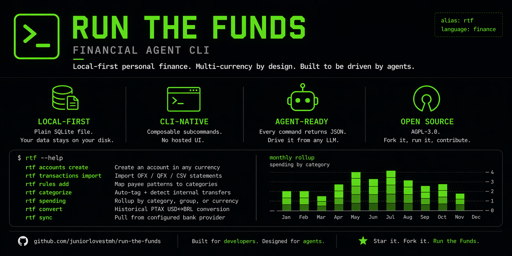

<p align="center">
  
</p>

# Run The Funds

**A local-first, agent-ready personal finance CLI for multi-currency
households.**

Run The Funds (`rtf`) is a Rust command-line tool for people who live
between currencies and want their finance data — accounts, transactions,
categories, rules, spending rollups, and eventually holdings — sitting in
a plain SQLite file they control, with every subcommand emitting a
consistent JSON envelope so an LLM or external agent can orchestrate it
end-to-end.

It is **not** a budgeting app with a UI. It is the data + analysis layer
that sits underneath whatever UI is preferred — personal scripts, Claude
Code, a spreadsheet, a Monarch Money workflow, or a future web dashboard.

## Why

Consumer personal-finance aggregators like Monarch Money, Copilot, and
Mint-era tools work well inside a single country. They fall apart the
moment a household straddles two banking systems, for several reasons:

- **No coverage outside the US.** Plaid and Finicity — the providers that
  aggregators resell — have near-zero presence in Latin American banks.
  Once money leaves via Wise, every downstream Brazilian charge is
  invisible.
- **Single-currency accounting.** Most hosted aggregators display
  everything in USD, with a best-effort FX approximation. That is fine for
  a visitor but wrong for someone who actually earns, spends, and holds
  assets in another currency. Real reconciliation needs dated central-bank
  rates (BCB PTAX for BRL↔USD), not a moving 30-day average.
- **No programmatic surface.** Most aggregators expose either no API at
  all, or a reverse-engineered GraphQL that can break on any release.
  Agentic workflows need a stable, documented interface.
- **Analyses are limited to what the vendor ships.** Per-person
  attribution, PTAX-aware net-worth history, strategy-specific debt
  payoff, goal projection — if the vendor doesn't build it, it doesn't
  exist.

Run The Funds addresses these constraints by pushing the data into a
local SQLite database, modeling money as a first-class domain object with
a currency discriminator, using the BCB PTAX endpoint for historical FX,
and emitting structured JSON on every CLI call so external tooling (LLMs,
scripts, spreadsheets) can compose subcommands freely.

## Current feature set

- **Domain model** — accounts, transactions, categories, category groups,
  rules, transaction splits, tags, transfer pairs, exchange rates,
  beneficiaries (persons). DDD layout with repository traits at the
  boundary. Money is `rust_decimal::Decimal` with an explicit
  `CurrencyCode` discriminator; `f64` is never used for money.
- **Import** — OFX / QFX / CSV. The OFX parser handles both the SGML 1.x
  dialect and the XML 2.x dialect, plus the hybrid dialect some banks
  (e.g. Nubank) emit with XML-style closing tags on top of an SGML
  header.
- **Multi-currency PTAX** — lazy-fetches historical USD↔BRL rates from
  Banco Central do Brasil's public endpoint, caches per-date, walks back
  up to five calendar days on weekends/holidays. Every BRL transaction is
  annotated with its USD equivalent on `transactions list`.
- **Bank sync adapters** — SimpleFIN, Pluggy (with browser-based Connect
  widget), and Teller (with mTLS client-cert support for Development and
  Production tiers). Live in-tree but dormant by default. Replaced for
  day-to-day use by the forthcoming Monarch adapter.
- **Categorization engine** — user-defined rules with three match kinds
  (substring, regex, amount-DSL like `>100` / `<=50` / `=0`),
  priority-ordered application with per-rule fire counts in the report.
  Same-currency transfer-pair detection across accounts within a
  ±3-day window. Transaction splits that expand cleanly into reports.
- **Spending reports** by category / group / account / currency with
  optional date windows, transfer exclusion by default, table + JSON
  output.
- **Monarch Money ingest** (in progress, S06) — shells out to the
  community `mmoney` CLI and imports accounts, category groups,
  categories, tags, and transactions while preserving Monarch's external
  IDs for idempotent re-sync.
- **Agent-ready CLI envelope** — every subcommand returns either
  `{status:"ok", data:…}` on stdout or `{status:"error", message:…}` on
  stderr, with a stable shape across versions.

## Roadmap

| Slice | Status | Scope |
|---|---|---|
| S01 | ✅ | Domain foundation + SQLite storage |
| S02 | ✅ | Transaction import pipeline (OFX + CSV) |
| S03 | ✅ | Multi-currency PTAX |
| S04 | ✅ | SimpleFIN + Pluggy adapters |
| S04B | ✅ | Teller adapter with mTLS |
| S04C | ✅ | Browser-based Connect flow |
| S04D | ✅ | Connection removal CLI |
| S05 | ✅ | Categorization engine |
| S06 | 🔄 | Monarch adapter + tags domain |
| S07 | ⬜ | Investments & holdings schema with PTAX-aware valuation |
| S08 | ⬜ | Goals, debt payoff, financial health score, bill schedule |
| S09 | ⬜ | Agent-ready query layer + CSV/JSON export |

Planning artifacts for every slice — PLAN, UAT, SUMMARY — live in
[`.gsd/milestones/M001/slices/`](.gsd/milestones/M001/slices/) and are
checked in alongside the code.

## Install

```bash
git clone https://github.com/<your-user>/run-the-funds.git
cd run-the-funds
cargo build --release
# Binary: target/release/rtf
# Symlink somewhere on PATH if desired:
# ln -s "$(pwd)/target/release/rtf" ~/.local/bin/rtf
```

Requirements:

- Rust stable, edition 2024.
- No system SQLite — `rusqlite` is bundled.

## Quick start

```bash
# Create an account
rtf accounts create --name "Chase Checking" --type checking \
    --currency USD --owner owner

# Import a QFX or CSV file
rtf transactions import --format ofx --file /path/to/statement.qfx \
    --account-id <account-uuid>

# Historical currency conversion (PTAX, cached after first fetch)
rtf convert 1000 BRL --to USD --date 2026-03-15

# Set up categories
rtf category-groups create --name "Essentials"
rtf categories create --name "Groceries" --group-id <group-uuid>

# Auto-categorize via rules
rtf rules add --name "Whole Foods" --match-field payee \
    --pattern "WHOLE FOODS" --category-id <cat-uuid>
rtf categorize

# Detect internal transfers (same-currency, ±3 days, cross-account)
rtf categorize --detect-transfers

# Spending rollup
rtf spending --from 2026-04-01 --to 2026-04-30
rtf spending --from 2026-04-01 --to 2026-04-30 --format json
```

Every command accepts `--help`. Every command accepts `--format json` when
it returns data.

## Architecture

Four layers, enforced by module boundaries:

```
src/
├── domain/          pure business types + repository traits (no I/O)
├── application/     services that orchestrate domain + repositories
├── infrastructure/  SQLite repo impls, HTTP clients, bank-sync adapters
└── cli/             clap subcommand handlers, JSON envelope formatting
```

Money is `rust_decimal::Decimal` throughout. Transactions carry
`amount: Money { amount, currency }`. No silent currency coercion: BRL
and USD live side-by-side in the same table with a `(currency)`
discriminator, and the spending rollup is per-currency until an explicit
PTAX-reconciled cross-currency rollup is requested.

Credentials for bank-sync adapters live in a SQLite table
`provider_credentials`, never in environment variables or config files.
See
[`.gsd/milestones/M001/slices/S04/SECURITY.md`](.gsd/milestones/M001/slices/S04/SECURITY.md)
for the plaintext-on-disk threat model.

## Testing

```bash
cargo test
```

The suite runs roughly 430 tests across the library and four integration
binaries. Tests that would hit live bank APIs are marked `#[ignore]` and
are only exercised by manual verification after a credential setup.

Fixtures under `tests/fixtures/` (`chase-sample.qfx`,
`nubank-sample.ofx`) are fully synthetic — three transactions each with
placeholder account numbers, routing numbers, and merchant names — and
exist solely to pin parser behavior.

## Planning methodology

Run The Funds is developed using a "get stuff done" planning workflow.
Each milestone is decomposed into slices; each slice into tasks. Every
slice carries three markdown artifacts (PLAN before work starts, UAT
after, SUMMARY at close), all version-controlled. A reader who wants to
understand why a decision was made six months ago can walk
`.gsd/milestones/M001/slices/<id>/` and read the frozen plan, the
verification, and the retrospective.

This is heavier than typical OSS process and is deliberate: the project
is driven largely by LLM agents, and agents need context that is
grounded, dated, and structured rather than folklore.

## Contributing

Contributions are welcome, particularly in:

- **Country / bank adapters** — new OFX dialects, CSV formats, direct
  APIs (especially for Brazilian and European banks).
- **Categorization heuristics** — transfer detection across currencies,
  recurring-subscription detection, merchant-name normalization.
- **Investments schema (S07)** — holdings, cost-basis lots, historical
  valuation.
- **Agent tooling** — reference prompts, Claude / MCP integrations,
  JSON-schema descriptions of the CLI envelope.

Workflow:

1. Open an issue before starting anything larger than a small bug fix.
2. One commit per shipped slice (not per task).
3. `cargo test` and `cargo build` must remain green.
4. By contributing, you agree your contributions are licensed under the
   project's license below.

## License

Run The Funds is licensed under the
[**GNU Affero General Public License, version 3**](./LICENSE) (AGPL-3.0).

The AGPL is a strong copyleft license: the source code may be freely
used, modified, and redistributed, and any modified version that is
offered to users — including over a network — must release its complete
corresponding source code under the same license.

In practice, this means the project is open to personal use, academic
use, and contribution, while closing the door on incorporation into
proprietary hosted services without reciprocating by opening the rest of
the stack.

For licensing arrangements outside of the AGPL, open an issue.

## Acknowledgments

- [Banco Central do Brasil](https://www.bcb.gov.br/) for publishing
  historical PTAX rates via a free public endpoint.
- [`mmoney-cli`](https://github.com/theFong/mmoney-cli) and
  [`monarchmoney`](https://github.com/hammem/monarchmoney) for the
  unofficial Monarch Money clients the S06 adapter targets.
